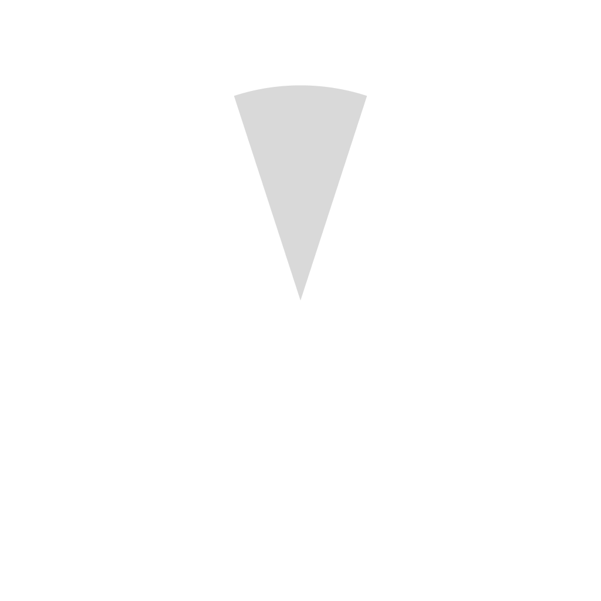
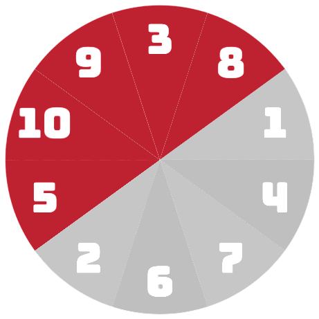
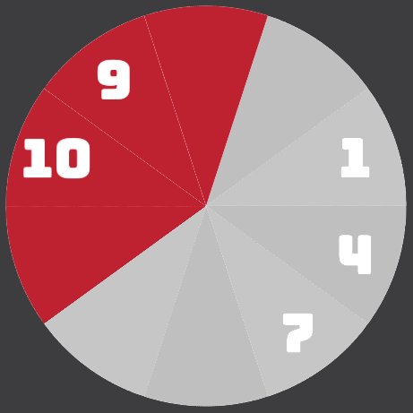
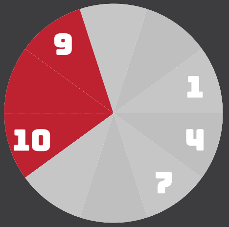

# Update Log


 


> Minor update version 0.2.0

<!-- 
Platinum/White-Gold: #E5E4E2
Gold: #FFD700
Silver: #C0C0C0
Bronze: #CD7F32

Legendary (Orange): #FF8000
Epic (Purple): #A335EE
Rare (Blue): #0070DD
Uncommon (Green): #1EFF00
Common (White/Grey): #9D9D9D

Celestial Blue: #4DEEE1
Void/Deep Space: #0B0E11 (with high-contrast accents)
Radiant Crimson: #FF003F
 -->

> This update shifts the project toward a more modular and robust architecture, <br>
> focusing on the separation of concerns and the elimination of logical "ghost" states in the game loop.

<br>

## Update Highlight and Feature

* [overload re-logic](#overload-re-logic)


## Assets

|  |  |  |
| :---: | :---: | :---: |
| **slice.png** | **sum17_icon.png** | **sum17_title_icon.png** |

<br>

* Put all `slice 1-10` into archived folder and use 1 `slice.png` for `asset.rs` to use in drawing, <br>
    which also change rotation of drawing to match `circle_slots` index arrangement


* Add `OVERLOADED` color to `palette.rs` along side black palette placeholder and change some blue palette

* Add 2 new icon `sum17_icon.png` and `sum17_title_icon.png`


## Logic and Module

* Created new rust file `logic.rs` moved heavy and often use logic into this file. <br>
    includes `check_adjacent_sum` `get_slot_center_offset` `update_interaction_system`. <br>
    Planing to further expand on simplify the `main.rs` and organize its heavy-in-dependencies


* Change `object module`'s allow unused to be files-wide


## Main.rs

* Now use module [`logic.rs`](#logic-and-module)

* Added **breadcrum-navigation** marker, <br>
    more mark point to navigate with breadcrum 
    ```rust
    { const _LOAD_RESOURCES: () = (); } // for navigation

    { const _TASK_1: () = (); } // for navigation
    ```  

* Integrate `logic.rs` code
    ```rust
    logic::update_interaction_system();

    logic::check_adjacent_sum();
    ```  


* ### Overload Re-Logic

    |  |  |
    | :---: | :---: |
    | **overloaded_empty_slot** | **bluetooth_overload** |

    <br>

  * Changes from old slices used to have overloaded state even without `Number` in that slot. <br>
    Slice are now only in overloaded state if that slot contains `Number`. <br>
    ```rust
    slot_overloaded[(i + 9) % 10] = circle_slots[(i + 9) % 10].is_some();
    slot_overloaded[(i + 1) % 10] = circle_slots[(i + 1) % 10].is_some();
    ```

  * Slice without `Number` contained will not calculate adjacent sum to prevent **bluetooth-overload**.
    ```rust
    if circle_slots[i].is_none() { continue; }
    ```

* Optimize `Number` drawing a bit. <br>
    Using ```iter()``` and ```chain()``` both box that could contains number and draw in one iteration
    ```rust
    circle_slots.iter()
        .flatten()
        .chain(numbers.iter())
        .for_each(|num| num.draw(&assets.font, &center));
    ```

* Minor code refractoring detials


## WebBuild

* new [icon](#assets)